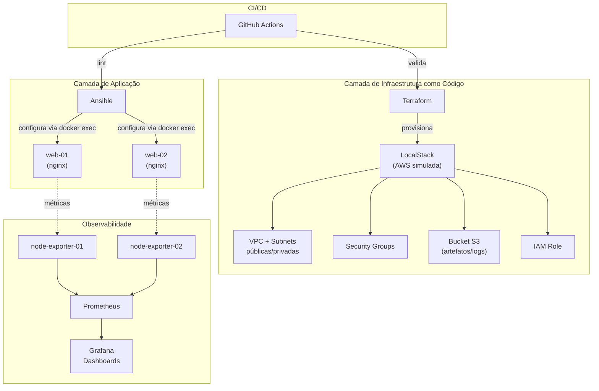

# ☁️ cloud-infra-lab

Laboratório de infraestrutura em nuvem **100% local e gratuito**: provisiona uma
rede AWS simulada com **Terraform + LocalStack**, configura servidores com
**Ansible**, e monitora tudo com **Prometheus + Grafana** — tudo orquestrado
com **Docker Compose** e validado automaticamente via **GitHub Actions**.

> Projeto de portfólio construído para consolidar a transição de infraestrutura
> tradicional (redes, servidores) para Cloud/DevOps, aplicando na prática as
> ferramentas mais usadas por times de plataforma hoje.

---

## Por que esse projeto existe

Quem vem de redes e administração de servidores já entende os conceitos —
sub-redes, firewalls, disponibilidade, monitoramento. O que muda no mundo
cloud/DevOps é *como* isso é feito: em vez de configurar um switch na mão,
você escreve isso em código (IaC); em vez de logar via SSH em cada máquina,
você automatiza com Ansible; em vez de olhar gráficos isolados por servidor,
você centraliza observabilidade.

Este laboratório foi desenhado para praticar exatamente essa transição, sem
custo de nuvem: o **LocalStack** simula a API da AWS na sua própria máquina,
então o mesmo código Terraform escrito aqui funciona (com ajustes mínimos)
contra uma conta AWS real.

## Arquitetura



**Fluxo:** o Terraform provisiona a camada de rede/cloud (VPC, subnets,
security groups, S3, IAM) contra o LocalStack. Em paralelo, o Ansible entra
nos containers `web-01`/`web-02` — que representam os servidores que, em um
cenário real, teriam sido provisionados nessa VPC — e instala/configura o
nginx de forma idempotente. O Prometheus coleta métricas de cada servidor via
`node-exporter`, e o Grafana exibe tudo em dashboards. O GitHub Actions valida
cada peça (`terraform validate`, `ansible-lint`, `yamllint`, `docker compose
config`) a cada push.

## Stack utilizada

| Camada | Ferramenta | Para quê |
|---|---|---|
| IaC / Cloud | Terraform + LocalStack | Provisionar VPC, subnets, security groups, S3, IAM sem custo |
| Configuração | Ansible | Instalar e configurar nginx nos servidores de forma automatizada e idempotente |
| Containers | Docker Compose | Orquestrar todos os serviços do laboratório localmente |
| Observabilidade | Prometheus + Grafana + node-exporter | Coletar e visualizar métricas dos servidores |
| CI/CD | GitHub Actions | Validar Terraform, Ansible e configs a cada push |

## Estrutura do repositório

```
cloud-infra-lab/
├── terraform/          # VPC, subnets, security groups, S3, IAM (LocalStack)
├── ansible/             # Playbook + role para configurar os servidores web
├── monitoring/           # Configuração do Prometheus e provisionamento do Grafana
├── docker-compose.yml   # Sobe LocalStack, servidores, Prometheus e Grafana
├── scripts/              # deploy.sh / destroy.sh — automação ponta a ponta
├── .github/workflows/    # Pipeline de validação (CI)
└── Makefile              # Atalhos (make deploy, make destroy, ...)
```

## Como rodar

Pré-requisitos: [Docker](https://docs.docker.com/get-docker/) e
[Terraform](https://developer.hashicorp.com/terraform/install) instalados.
Ansible (`pip install ansible-core`) e a coleção `community.docker`
(`ansible-galaxy collection install -r ansible/requirements.yml`).

Subida completa, automatizada:

```bash
git clone https://github.com/SEU_USUARIO/cloud-infra-lab.git
cd cloud-infra-lab
./scripts/deploy.sh
```

Ou passo a passo, pra entender cada etapa:

```bash
# 1. Sobe LocalStack, servidores e stack de monitoramento
docker compose up -d

# 2. Provisiona a infraestrutura "AWS" (VPC, subnets, SGs, S3, IAM)
cd terraform
terraform init
terraform apply

# 3. Configura os servidores web via Ansible
cd ../ansible
ansible-galaxy collection install -r requirements.yml
ansible-playbook playbook.yml
```

Depois disso, acesse:

| Serviço | URL | Credenciais |
|---|---|---|
| Servidor web-01 | http://localhost:8081 | — |
| Servidor web-02 | http://localhost:8082 | — |
| Prometheus | http://localhost:9090 | — |
| Grafana | http://localhost:3000 | `admin` / `admin` |
| LocalStack (API AWS simulada) | http://localhost:4566 | — |

Pra derrubar tudo: `./scripts/destroy.sh` (ou `make teardown`).

## O que este projeto demonstra

- **Infraestrutura como código**: rede, segurança e storage definidos em
  Terraform, versionados e reproduzíveis — nada configurado manualmente.
- **Gerenciamento de configuração**: Ansible aplicando configuração de forma
  idempotente, com roles, templates Jinja2 e handlers.
- **Containers**: orquestração de múltiplos serviços com Docker Compose,
  incluindo redes e volumes.
- **Observabilidade**: stack de monitoramento real (Prometheus + Grafana)
  coletando métricas de sistema dos servidores.
- **CI/CD**: pipeline que valida a infraestrutura antes de qualquer aplicação
  real — a mesma prática usada por times de plataforma em produção.
- **Custo zero**: tudo roda localmente, sem depender de conta de nuvem paga.

## Próximos passos (roadmap)

- [ ] Adicionar um load balancer (nginx ou HAProxy) na frente dos dois servidores
- [ ] Migrar o Terraform para rodar contra uma conta AWS real (free tier)
- [ ] Adicionar alertas no Prometheus (Alertmanager) com notificação no Slack
- [ ] Escrever testes de infraestrutura com Terratest ou InSpec

## Sobre

Projeto feito por **Pedro Woruby** como parte da transição de infraestrutura
tradicional (redes e servidores) para Cloud/DevOps. Feedback e sugestões são
muito bem-vindos — abra uma issue ou me chame no LinkedIn.

## Licença

Este projeto está sob a licença MIT — veja o arquivo [LICENSE](LICENSE).
